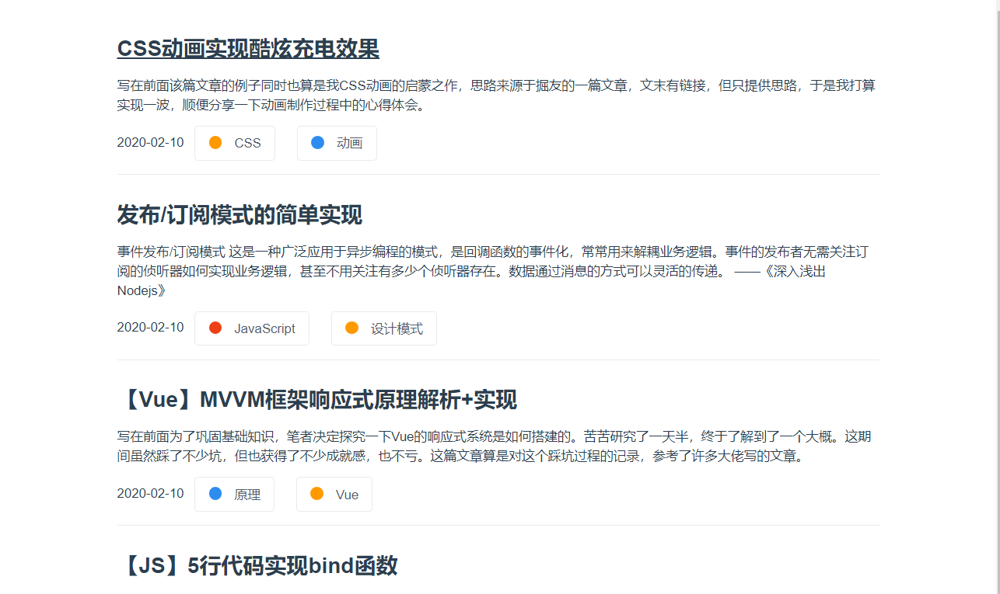
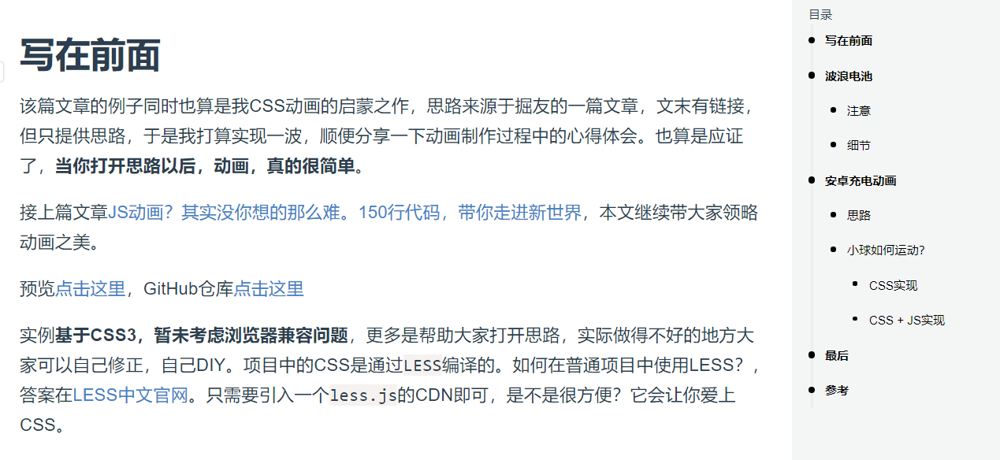
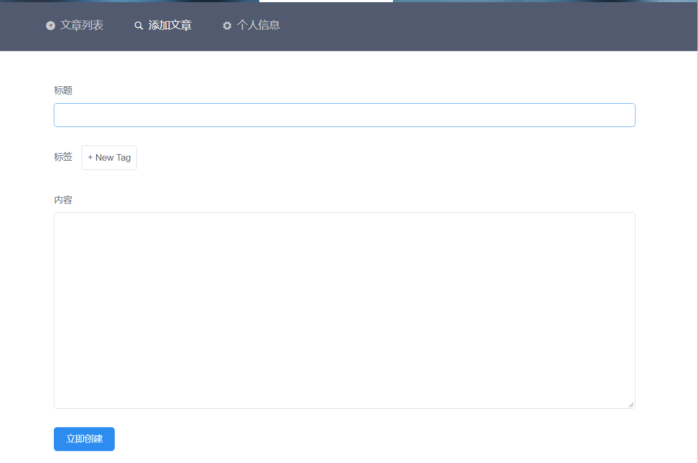

# 展示型个人博客
看不少大佬都有自己的博客网站，我也有点心动了。虽然我不是大佬，但也在朝着这个方向努力。
为了能有一个自己的主页，能在介绍自己的时候跳转过去装装逼啥的（咳咳其实这是次要的...）。

总之呢，这是一个展示型的简约博客，也可以说是个人主页，不是那种登陆注册一堆的系统。
**只要替换掉后端数据就可以为你所用**。后端代码等完善了再放出来。

# 说明
## UI
使用[view-design（iview）](https://www.iviewui.com/docs/introduce)作为UI框架。
辗转了好多个UI框架：vue-beauty，element-ui等等最终还是选择了iview。主要还是因为，
好看又灵活，基础样式已经可以满足80%的需求了，样式容易修改。缺点是坑真的很多，比如引入方面，
我还是最终去源目录中探索了一番才正确引用，其他就不多说了，好看是真的。

## 优化
正因为iview在引入方面的坑，我无法使用CDN，整块引入打包后的体积不堪入目...所以只能硬着头皮按需引入，一个个写。
这还没完，按需引入打包后体积还是很大，所以我就干脆使用动态链接库（DLL）的方式进行优化了，不过好在，优化效果非常明显，
页面秒开无压力。而在进行依赖提取的过程中，我又遇到了一些问题（心累），后面我会整理成文章补充到这里来。

# 快速开始
```
// 安装依赖
npm install
// 编译动态链接库，如果库文件没有变更则可以省略这一步
npm run dll
// 开发模式
npm run serve
// 构建生产环境代码
npm run build
// eslint规范代码
npm run lint
```

# 截图
## 文章列表界面


## 文章界面


## 管理界面


